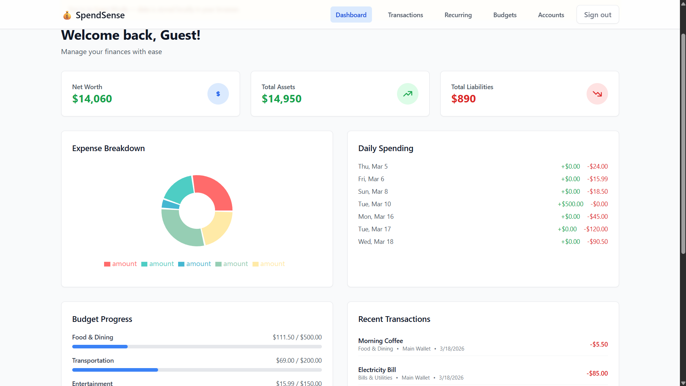
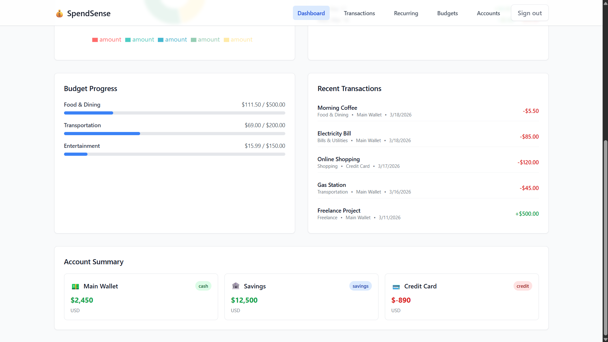
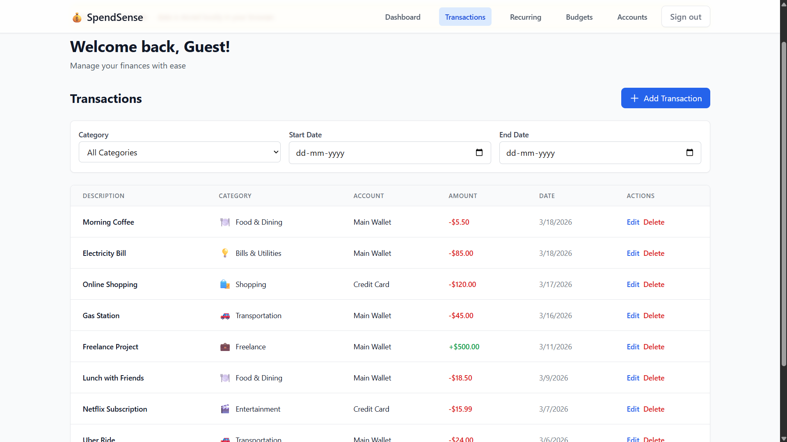
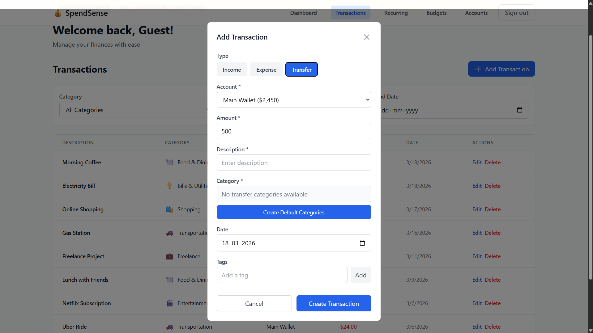
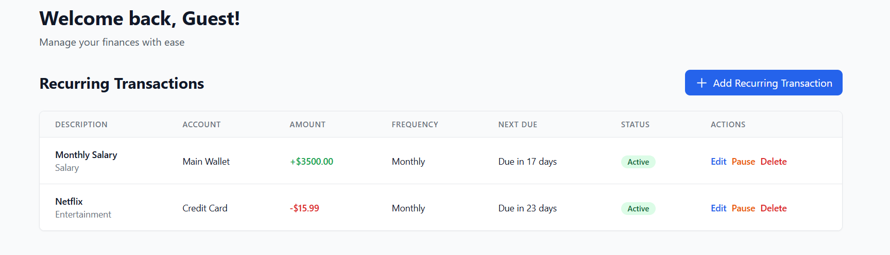
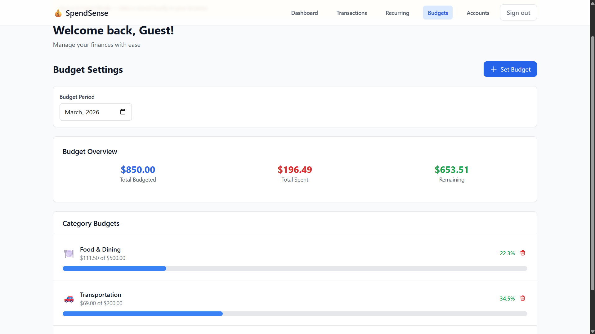
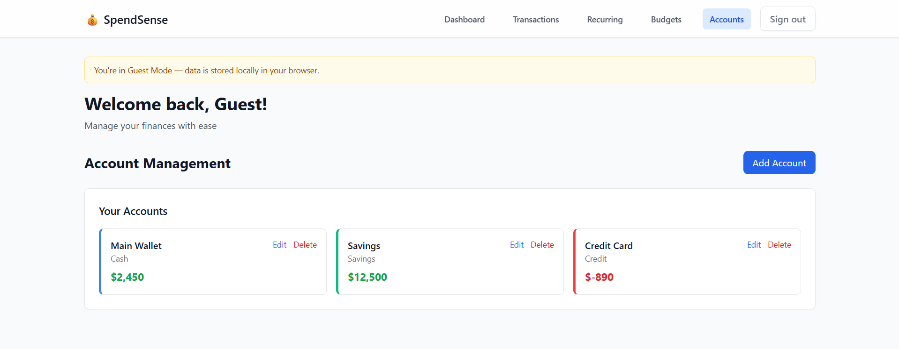

<div align="center">

# SpendSense

**Real-time expense management for people who take their money seriously.**

[](https://react.dev/)
[](https://www.typescriptlang.org/)
[](https://convex.dev/)
[](https://tailwindcss.com/)
[](https://spend-sense-one-tau.vercel.app)

[Live Demo](https://spend-sense-one-tau.vercel.app) · [Report Bug](https://github.com/Satyamsinghh76/SpendSense/issues) · [Request Feature](https://github.com/Satyamsinghh76/SpendSense/issues)

</div>

---

## Overview

Most budgeting tools are either too simple (a spreadsheet with extra steps) or too complex (enterprise ERP software crammed into a mobile screen). SpendSense sits in the middle — a full-featured, real-time personal finance platform that handles multi-account tracking, double-entry bookkeeping, automated recurring transactions, and budget analysis without requiring a finance degree to operate.

**Built for:** Individuals and freelancers managing multiple income streams, credit lines, savings goals, and monthly budgets across different accounts.

**Why it matters:** Financial visibility is the first step to financial control. SpendSense provides that visibility with zero sync delays, zero page refreshes, and zero data loss — powered by Convex's real-time backend infrastructure.

---

## Features

### Core Financial Engine
- **Multi-Account System** — Cash, credit cards, savings, loans, and investment accounts with independent balance tracking
- **Double-Entry Bookkeeping** — Transfers between accounts correctly debit and credit both sides
- **Automated Balance Reconciliation** — Account balances update in real-time as transactions are created, modified, or deleted
- **Cascading Data Integrity** — Deleting an account cleans up all associated transactions and recurring entries

### Transaction Management
- **Full CRUD Operations** — Create, read, update, delete transactions with category tagging
- **Transfer Support** — Move money between accounts with proper debit/credit handling
- **Tag System** — Attach custom tags to transactions for flexible organization
- **Advanced Filtering** — Filter by account, category, date range, or any combination

### Budget Intelligence
- **Monthly Budget Allocation** — Set spending limits per category per month
- **Budget vs. Actual Comparison** — Real-time tracking of budgeted amount vs. actual spending
- **Overspend Detection** — Visual warnings when spending exceeds budget thresholds
- **Period Navigation** — Review budget performance across any month

### Recurring Transactions
- **Automated Scheduling** — Define recurring income/expenses with daily, weekly, monthly, or yearly frequency
- **Cron-Based Processing** — Hourly server-side job processes due transactions automatically
- **Lifecycle Management** — Start dates, optional end dates, pause/resume controls
- **Expiry Cleanup** — Daily cron deactivates expired recurring entries

### Dashboard & Analytics
- **Net Worth Calculator** — Real-time total assets minus total liabilities
- **Expense Breakdown** — Category-level spending distribution via interactive pie charts
- **Daily Spending Trends** — Income vs. expense visualization over time
- **Recent Activity Feed** — Quick-glance view of latest transactions

### Receipt Management
- **Image Upload** — Attach receipt photos to transactions via Convex file storage
- **OCR Pipeline** — Scheduled server-side action for receipt text extraction (extensible to Google Vision, Tesseract, etc.)
- **Structured Data Extraction** — Parses merchant name, amount, date, and line items

### Authentication & Guest Mode
- **Email/Password Auth** — Secure signup and login via `@convex-dev/auth`
- **Anonymous Sign-In** — Quick access without creating an account
- **Guest Mode** — Full UI access with localStorage-backed demo data, zero backend calls
- **Seamless Transition** — Guest data and real user data coexist without conflicts

---

## Tech Stack

| Layer | Technology | Purpose |
|-------|-----------|---------|
| **Frontend** | React 19, TypeScript 5.7 | UI components and type safety |
| **Styling** | Tailwind CSS 3 | Utility-first responsive design |
| **Build Tool** | Vite 6 | Fast HMR and optimized production builds |
| **Backend** | Convex | Real-time serverless functions and database |
| **Auth** | @convex-dev/auth (Password + Anonymous) | JWT-based authentication with RSA signing |
| **Charts** | Recharts 3 | Interactive data visualization |
| **Notifications** | Sonner | Toast notifications |
| **Deployment** | Vercel (frontend) + Convex Cloud (backend) | Global CDN + distributed serverless |

---

## Architecture

```
┌─────────────────────────────────────────────────────────────┐
│                        CLIENT                                │
│                                                             │
│  React 19 SPA (Vite)                                        │
│  ├── features/auth       → Login, Signup, Guest Mode        │
│  ├── features/dashboard  → Net Worth, Charts, Activity      │
│  ├── features/accounts   → Multi-Account CRUD               │
│  ├── features/transactions → Expense/Income Logging         │
│  ├── features/budgets    → Budget Planning & Tracking       │
│  └── features/recurring  → Automated Transaction Setup      │
│                                                             │
│  lib/data-hooks.ts  ← Guest-aware hooks that auto-switch    │
│                       between Convex queries and             │
│                       localStorage for guest users           │
└──────────────┬──────────────────────────────────────────────┘
               │
               │  WebSocket (real-time subscriptions)
               │  HTTPS (mutations & actions)
               │
┌──────────────▼──────────────────────────────────────────────┐
│                     CONVEX CLOUD                             │
│                                                             │
│  Serverless Functions                                       │
│  ├── Queries    → list, getBalanceSummary, getExpense...    │
│  ├── Mutations  → create, update, remove (with balance      │
│  │                reconciliation on every write)             │
│  ├── Actions    → signIn, processOCR                        │
│  └── Cron Jobs  → processRecurringTransactions (hourly)     │
│                   cleanupExpired (daily @ 2 AM)             │
│                                                             │
│  Database (8 tables)                                        │
│  ├── accounts, transactions, recurringTransactions          │
│  ├── budgets, categories, receipts                          │
│  ├── transactionTemplates, walletInvitations                │
│  └── Auth tables (users, sessions, accounts, etc.)          │
│                                                             │
│  Auth (RSA-signed JWTs)                                     │
│  ├── Password provider (email/password)                     │
│  ├── Anonymous provider                                     │
│  └── HTTP routes auto-registered via auth.addHttpRoutes()   │
└─────────────────────────────────────────────────────────────┘
```

**Data Flow:** Every query is a real-time subscription. When any client writes a transaction, all connected clients see the updated balances, charts, and budget progress instantly — no polling, no manual refresh.

---

## Screenshots

### Dashboard — Financial Overview



### Transaction Management



### Recurring Transactions


### Budget Tracking


### Account Management & Guest Mode


---

## Getting Started

### Prerequisites

- **Node.js** 18+ installed
- A free [Convex](https://convex.dev) account

### 1. Clone the repository

```bash
git clone https://github.com/Satyamsinghh76/SpendSense.git
cd SpendSense
```

### 2. Install dependencies

```bash
npm install
```

### 3. Set up Convex

```bash
npx convex dev
```

On first run, Convex will prompt you to log in and create a project. This generates `.env.local` with your deployment URL automatically.

### 4. Set up authentication environment variables

```bash
# Generate RSA keys for JWT signing
node -e "
const crypto = require('crypto');
const fs = require('fs');
const { privateKey, publicKey } = crypto.generateKeyPairSync('rsa', {
  modulusLength: 2048,
  privateKeyEncoding: { type: 'pkcs8', format: 'pem' },
  publicKeyEncoding: { type: 'spki', format: 'pem' },
});
const jwk = crypto.createPublicKey(publicKey).export({ format: 'jwk' });
jwk.alg = 'RS256'; jwk.use = 'sig'; jwk.kid = crypto.randomUUID();
fs.writeFileSync('.tmp_key.pem', privateKey.trim());
fs.writeFileSync('.tmp_jwks.json', JSON.stringify({ keys: [jwk] }));
console.log('Keys generated. Now set them:');
"

# Set environment variables on your Convex deployment
node ./node_modules/convex/bin/main.js env set JWT_PRIVATE_KEY -- "$(cat .tmp_key.pem)"
node ./node_modules/convex/bin/main.js env set JWKS -- "$(cat .tmp_jwks.json)"
node ./node_modules/convex/bin/main.js env set AUTH_SECRET -- "$(node -e "console.log(require('crypto').randomBytes(32).toString('hex'))")"
node ./node_modules/convex/bin/main.js env set SITE_URL -- "http://localhost:5173"

# Clean up temp files
rm .tmp_key.pem .tmp_jwks.json
```

### 5. Start the development server

```bash
npm run dev
```

This runs both frontend (Vite on `http://localhost:5173`) and backend (Convex dev) concurrently.

---

## Environment Variables

All environment variables are stored on the **Convex deployment**, not in `.env` files.

| Variable | Description | Where |
|----------|------------|-------|
| `JWT_PRIVATE_KEY` | RSA private key (PEM format) for signing auth tokens | Convex deployment |
| `JWKS` | JSON Web Key Set (public key) for token verification | Convex deployment |
| `AUTH_SECRET` | 256-bit hex string for session encryption | Convex deployment |
| `SITE_URL` | Frontend URL (used for auth redirects) | Convex deployment |
| `VITE_CONVEX_URL` | Convex deployment URL (auto-set) | `.env.local` |
| `CONVEX_DEPLOYMENT` | Deployment identifier (auto-set) | `.env.local` |

---

## Deployment

### Frontend → Vercel

1. Push your code to GitHub
2. Import the repo in [Vercel](https://vercel.com)
3. Add environment variable:
   - `CONVEX_DEPLOY_KEY` → Get from Convex Dashboard > Settings > Deploy Key (must start with `prod:`)
4. Vercel auto-detects the config from `vercel.json`
5. Every push to `main` triggers automatic deployment

### Backend → Convex Cloud

Handled automatically during the Vercel build via `npm run build:prod`, which runs:

```bash
npx convex deploy --cmd 'vite build'
```

This deploys backend functions and builds the frontend in a single step.

### Post-Deployment

Set auth environment variables on the **production** Convex deployment:

```bash
export CONVEX_DEPLOY_KEY='prod:your-deployment|your-key'
node ./node_modules/convex/bin/main.js env set JWT_PRIVATE_KEY -- "$(cat key.pem)"
node ./node_modules/convex/bin/main.js env set JWKS -- "$(cat jwks.json)"
node ./node_modules/convex/bin/main.js env set AUTH_SECRET -- "your-secret"
node ./node_modules/convex/bin/main.js env set SITE_URL -- "https://your-app.vercel.app"
```

---

## Authentication Flow

```
┌─────────────┐     ┌──────────────────┐     ┌─────────────────┐
│  SignInForm  │────►│  @convex-dev/auth │────►│  Convex Database │
│             │     │  (server-side)    │     │  (users table)   │
│  Email +    │     │                  │     │                  │
│  Password   │     │  1. Hash password│     │  Store user +    │
│     OR      │     │  2. Create session│    │  session         │
│  Anonymous  │     │  3. Sign JWT     │     │                  │
│     OR      │     │     (RS256)      │     │                  │
│  Guest Mode │     └──────────────────┘     └─────────────────┘
└─────────────┘
       │
       │ Guest Mode bypasses Convex entirely
       ▼
┌─────────────────┐
│  localStorage    │
│  (guest-store)   │
│  Demo data +     │
│  Full CRUD       │
└─────────────────┘
```

- **Password auth:** Email/password → server-side hashing → JWT issued → stored in HTTP-only session
- **Anonymous auth:** One-click → temporary account created → full access
- **Guest mode:** Client-side only → pre-populated demo data → localStorage CRUD → zero network calls

All three modes use the same UI components. The `data-hooks.ts` layer transparently routes queries to either Convex or the local guest store.

---

## Project Structure

```
SpendSense/
├── convex/                        # Backend — serverless functions & schema
│   ├── schema.ts                  #   Database table definitions (8 tables)
│   ├── auth.ts                    #   Auth config + user initialization
│   ├── accounts.ts                #   Account CRUD + balance summary
│   ├── transactions.ts            #   Transaction CRUD + analytics queries
│   ├── budgets.ts                 #   Budget CRUD + budget vs. actual comparison
│   ├── categories.ts              #   Category management + defaults
│   ├── recurringTransactions.ts   #   Recurring logic + cron processing
│   ├── receipts.ts                #   Receipt upload + OCR pipeline
│   └── crons.ts                   #   Scheduled jobs (hourly + daily)
│
├── src/                           # Frontend — React application
│   ├── App.tsx                    #   Root component + navigation + auth gate
│   ├── main.tsx                   #   Entry point + providers
│   ├── features/                  #   Feature-based modules
│   │   ├── auth/                  #     Login, signup, guest mode context
│   │   ├── dashboard/             #     Dashboard, charts, summaries
│   │   ├── transactions/          #     Transaction list + form
│   │   ├── accounts/              #     Account manager
│   │   ├── budgets/               #     Budget settings + progress
│   │   └── recurring/             #     Recurring transaction management
│   └── lib/                       #   Shared utilities
│       ├── data-hooks.ts          #     22 guest-aware hooks (query + mutation)
│       └── guest-store.ts         #     localStorage store with reactive updates
│
├── vercel.json                    # Deployment config
├── vite.config.ts                 # Build config + path aliases
└── tailwind.config.js             # Design system tokens
```

---

## Backend API Reference

### Queries (real-time subscriptions)

| Function | Description |
|----------|------------|
| `accounts:list` | All accounts for the authenticated user |
| `accounts:getBalanceSummary` | Net worth, total assets, total liabilities, breakdown by type |
| `transactions:list` | Transactions with optional filters (account, category, date range) |
| `transactions:getExpenseBreakdown` | Category-level expense totals for a date range |
| `transactions:getDailySpending` | Daily income/expense aggregation |
| `budgets:list` | Budgets for a given period (YYYY-MM) |
| `budgets:getBudgetComparison` | Budgeted vs. actual spending per category |
| `categories:list` | All user categories (income + expense) |
| `recurringTransactions:list` | All recurring entries with account names |

### Mutations (writes with automatic balance reconciliation)

| Function | Description |
|----------|------------|
| `transactions:create` | Create transaction + update account balance (handles transfers) |
| `transactions:update` | Edit transaction + rebalance affected accounts |
| `transactions:remove` | Delete transaction + reverse balance impact |
| `accounts:create` | Create account (cash, credit, savings, loans, investment) |
| `accounts:remove` | Delete account + cascade delete all related transactions |
| `budgets:upsert` | Create or update budget for category/period |
| `recurringTransactions:create` | Schedule recurring transaction with auto-calculated next due date |

### Scheduled Jobs

| Job | Schedule | Description |
|-----|----------|-------------|
| `processRecurringTransactions` | Every hour | Finds and processes all due recurring transactions |
| `cleanupExpiredRecurringTransactions` | Daily at 2:00 AM | Deactivates recurring entries past their end date |

---

## Future Improvements

- [ ] **Real OCR Integration** — Replace mock OCR with Google Cloud Vision or Tesseract.js for actual receipt parsing
- [ ] **Shared Wallets** — Enable the existing `walletInvitations` schema for multi-user account sharing
- [ ] **Transaction Templates** — Activate the `transactionTemplates` table for one-tap frequent entries
- [ ] **Export to CSV/PDF** — Financial report generation for tax filing and bookkeeping
- [ ] **Multi-Currency Support** — Exchange rate integration for accounts in different currencies
- [ ] **Push Notifications** — Budget threshold alerts and recurring transaction confirmations
- [ ] **Data Import** — CSV/OFX import from bank statements
- [ ] **Mobile App** — React Native client using the same Convex backend

---

## Contributing

1. Fork the repository
2. Create a feature branch (`git checkout -b feature/your-feature`)
3. Commit your changes (`git commit -m 'Add your feature'`)
4. Push to the branch (`git push origin feature/your-feature`)
5. Open a Pull Request

Please ensure your code passes TypeScript checks (`npm run lint`) before submitting.

---

## License

This project is open source under the [MIT License](LICENSE).

---

## Author

**Satyam Singh**
- GitHub: [@Satyamsinghh76](https://github.com/Satyamsinghh76)

---

## Why This Project Stands Out

This isn't a tutorial todo app with a database bolted on. SpendSense demonstrates production-level engineering decisions:

- **Double-entry bookkeeping** — Transfers correctly debit one account and credit another, with balance reconciliation on every write, update, and delete
- **Real-time architecture** — Every query is a live subscription; changes propagate to all connected clients instantly via WebSocket
- **Automated server-side processing** — Cron jobs handle recurring transaction execution and lifecycle management without any client involvement
- **Graceful degradation** — Guest mode provides full UI functionality backed by a reactive localStorage store, using `useSyncExternalStore` for proper React integration
- **22 custom hooks** that transparently route between Convex and local storage based on auth state — components don't know or care which data source they're using
- **Cascading data integrity** — Deleting an account automatically cleans up all referencing transactions and recurring entries
- **Production deployment pipeline** — Single command (`npx convex deploy --cmd 'vite build'`) deploys backend functions and builds the frontend atomically
